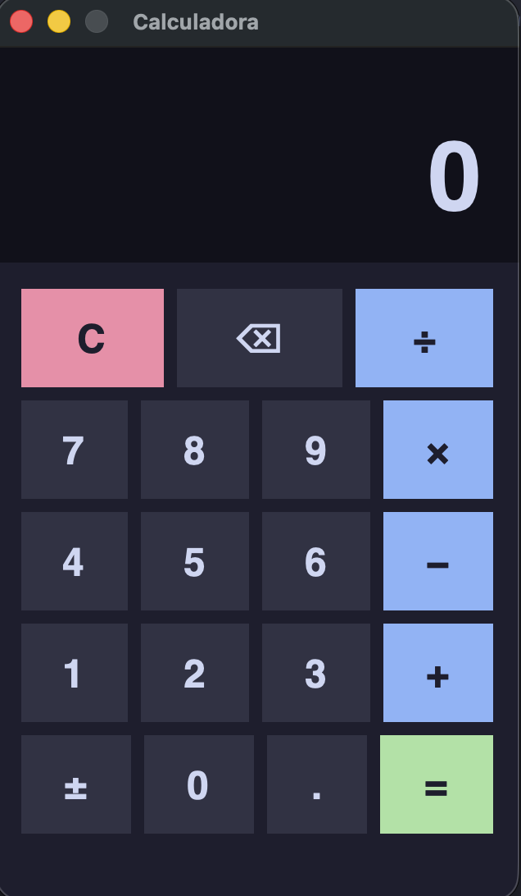

# Calculadora

Calculadora desktop com interface gráfica desenvolvida em Python, aplicando os princípios de Orientação a Objetos (POO) com o padrão Strategy para as operações matemáticas.



## Funcionalidades

- Soma, subtração, multiplicação e divisão
- Interface gráfica com tema escuro
- Suporte a teclado
- Tratamento de erros (ex: divisão por zero)

## Estrutura do projeto

```
Calculadora/
├── calculator.py       # Código principal (lógica + interface gráfica)
├── test_calculator.py  # Testes com pytest (50 casos)
└── README.md
```

### Arquitetura (POO + Strategy Pattern)

```
Operacao (ABC)           ← classe abstrata
├── Soma
├── Subtracao
├── Multiplicacao
└── Divisao

Calculadora              ← orquestra as operações
CalculatorApp            ← interface gráfica (tkinter)
```

## Pré-requisitos

- Python 3.13 (via Homebrew)
- python-tk@3.13

### Instalação dos pré-requisitos

```bash
brew install python-tk@3.13
```

### Configuração do ambiente virtual

```bash
uv venv .venv --python 3.13
uv pip install -r requirements.txt --python .venv/bin/python
```

> Se não tiver o `uv`: `brew install uv`

## Como rodar a calculadora

```bash
/opt/homebrew/bin/python3.13 calculator.py
```

> **Atenção:** use o Python do Homebrew (`/opt/homebrew/bin/python3.13`), pois o Python padrão do macOS não possui suporte ao tkinter.

### Atalhos de teclado

| Tecla | Ação |
|---|---|
| `0–9` / `.` | Digitar número |
| `+` `-` `*` `/` | Selecionar operação |
| `Enter` | Calcular |
| `Backspace` | Apagar último dígito |
| `Esc` | Limpar |

## Como rodar os testes

### Somente no terminal

```bash
.venv/bin/pytest test_calculator.py -v
```

### Gerando relatório HTML

```bash
.venv/bin/pytest test_calculator.py -v --html=relatorio.html --self-contained-html
```

Após rodar, abra o relatório no navegador:

```bash
open relatorio.html
```

O relatório mostra o resultado de cada teste, duração e detalhes de falhas caso existam.

### Cobertura dos testes (50 casos)

Os testes cobrem quatro categorias de cenários para cada operação:

- **Caminho feliz** — entradas válidas com resultado esperado
- **Casos limite** — zero, número negativo, decimais, números muito grandes/pequenos
- **Casos negativos** — entradas que devem gerar erro (ex: divisão por zero, operação inválida)
- **Propriedades matemáticas** — comutatividade, elemento neutro, resultado nulo

#### Soma — 10 testes

| Teste | Entrada | Resultado esperado |
|---|---|---|
| Inteiros positivos | `2 + 3` | `5` |
| Com zero (ambos lados) | `0 + 5`, `5 + 0` | `5` |
| Ambos negativos | `-3 + (-7)` | `-10` |
| Positivo com negativo | `10 + (-4)` | `6` |
| Decimais (ponto flutuante) | `0.1 + 0.2` | `≈ 0.3` |
| Comutatividade | `7 + 3 == 3 + 7` | verdadeiro |
| Ambos zero | `0 + 0` | `0` |
| Número muito grande | `1e308 + 1e308` | `≈ 2e308` |
| Número muito pequeno | `1e-308 + 1e-308` | `≈ 2e-308` |

#### Subtração — 8 testes

| Teste | Entrada | Resultado esperado |
|---|---|---|
| Resultado positivo | `10 - 4` | `6` |
| Resultado negativo | `3 - 8` | `-5` |
| Subtrair zero / subtrair de zero | `5 - 0`, `0 - 5` | `5`, `-5` |
| Ambos negativos | `-3 - (-7)` | `4` |
| Decimais | `1.5 - 0.5` | `≈ 1.0` |
| Ambos zero | `0 - 0` | `0` |
| Mesmo número | `5 - 5` | `0` |

#### Multiplicação — 11 testes

| Teste | Entrada | Resultado esperado |
|---|---|---|
| Inteiros positivos | `3 × 4` | `12` |
| Por zero | `99 × 0` | `0` |
| Por um (elemento neutro) | `7 × 1` | `7` |
| Ambos negativos | `-3 × (-4)` | `12` |
| Positivo por negativo | `5 × (-2)` | `-10` |
| Decimais | `1.5 × 2.0` | `≈ 3.0` |
| Comutatividade | `6 × 7 == 7 × 6` | verdadeiro |
| Ambos zero | `0 × 0` | `0` |
| Negativo por zero | `-5 × 0` | `0` |
| Fração × fração | `0.5 × 0.5` | `≈ 0.25` |

#### Divisão — 12 testes

| Teste | Entrada | Resultado esperado |
|---|---|---|
| Resultado inteiro | `10 ÷ 2` | `5` |
| Resultado decimal | `7 ÷ 2` | `≈ 3.5` |
| Por um (elemento neutro) | `8 ÷ 1` | `8` |
| Ambos negativos | `-12 ÷ (-3)` | `4` |
| Positivo ÷ negativo | `10 ÷ (-2)` | `-5` |
| Zero pelo número | `0 ÷ 5` | `0` |
| Resultado irracional | `10 ÷ 3` | `≈ 3.333...` |
| Negativo ÷ positivo | `-9 ÷ 3` | `-3` |
| **[NEGATIVO]** Divisão por zero | `5 ÷ 0` | `ValueError` |
| **[NEGATIVO]** Zero ÷ zero | `0 ÷ 0` | `ValueError` |
| **[NEGATIVO]** Negativo ÷ zero | `-5 ÷ 0` | `ValueError` |

#### Calculadora (integração) — 9 testes

| Teste | Cenário | Resultado esperado |
|---|---|---|
| Símbolos disponíveis | verifica os 4 operadores registrados | `{+, −, ×, ÷}` |
| Soma via `calcular()` | `3 + 2` | `5` |
| Subtração via `calcular()` | `10 - 4` | `6` |
| Multiplicação via `calcular()` | `3 × 4` | `12` |
| Divisão via `calcular()` | `10 ÷ 2` | `5` |
| **[NEGATIVO]** Operação desconhecida | símbolo `%` | `ValueError` |
| **[NEGATIVO]** Divisão por zero | `5 ÷ 0` | `ValueError` |
| **[NEGATIVO]** Símbolo vazio | `""` | `ValueError` |
| **[NEGATIVO]** Símbolo com espaço | `" + "` | `ValueError` |

## CI/CD

O projeto usa **GitHub Actions** para rodar os testes automaticamente a cada `push` ou `pull request` na branch `main`.

### O que acontece em cada execução

1. Checkout do código
2. Configuração do Python 3.13
3. Instalação das dependências via `requirements.txt`
4. Execução dos 50 testes com relatório HTML
5. Upload do relatório como artefato para download

### Como acessar o relatório gerado no CI

1. Acesse a aba **Actions** no repositório do GitHub
2. Clique na execução desejada
3. Role até a seção **Artifacts**
4. Baixe o arquivo `relatorio-testes`
5. Abra o `relatorio.html` no navegador

> O relatório é salvo mesmo quando testes falham (`if: always()`), facilitando a análise de erros.

### Workflow

```yaml
on:
  push:
    branches: [main]
  pull_request:
    branches: [main]
```

Arquivo completo em [`.github/workflows/ci.yml`](.github/workflows/ci.yml).
